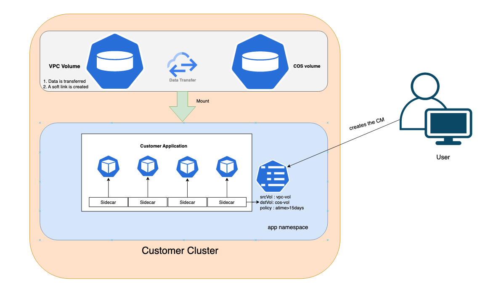

# persistent-volume-optimizer

## Introduction

persistent-volume-optimizer(as scoped for hackathon) is a k8s solution which will get installed as a sidecar on application pod and monitors persistent volumes to smartly distribute data across selected storage solutions.

## How it works

User has to add the persistent-volume-optimizer as a sidecar in their application pod and create a config map which has inputs on source(primary storage) and destination(secondary storage) volume mounts (storage solutions) and select the policy (no of days).

based on the policy i.e., no of days old files(cold data) that needs to be moved from primary storage to secondary storage.

persistent-volume-optimizer will keep monitoring the files on the primary storage in a scheduled manner and moves the files(which comply the policy defined) to secondary storage. Then a symlink is created for the file(that got moved) on primary storage to access it on secondary storage, thus there is no hindrance in the file access when user accesses data from primary storage.


## Architecture diagram




## How to use

1. Please add persistent-volume-optimizer sidecar container yaml to your application yaml as below. Add source and destination volume mounts to the container and make sure it has access to the respective volumes.

Example - /yamls/app-pod.yaml

As of now configmap name is fixed - `pvc-optimizer-01`, add your pod namespace value for `POD_NAMESPACE`

```
- name: persistent-volume-optimizer-pod
  image: bhagyak1/optimizer:27
  env:
    - name: CMNAME
      value: "pvc-optimizer-01"
    - name: POD_NAMESPACE
     value: "default"
  volumeMounts:
    - mountPath: /mnt/vpcdisk
      name: vpcdisk
    - mountPath: /mnt/cosdisk
      name: cosdisk
```

2. Create the below ServiceAccount, ClusterRole and ClusterRoleBinding to give k8s access to watch configmaps.   
You can change the namesapce of the resources to your app pod namespace.

```

---
apiVersion: v1
kind: ServiceAccount
metadata:
  name: pod-enable
  namespace: default
---
kind: ClusterRole
apiVersion: rbac.authorization.k8s.io/v1
metadata:
  name: pod-enable
  namespace: default
rules:
  - apiGroups: [""]
    resources: ["configmaps"]
    verbs: ["get", "list", "watch"]
---
kind: ClusterRoleBinding
apiVersion: rbac.authorization.k8s.io/v1
metadata:
  name: pod-enable
  namespace: default
subjects:
  - kind: ServiceAccount
    name: pod-enable
    namespace: default
roleRef:
  kind: ClusterRole
  name: pod-enable
  apiGroup: rbac.authorization.k8s.io

```

3. Make sure you have the volume mounts in place for source volume (primary storage) and destination volume (secondary storage).

4. Once the application pod is created, create the configmap (with name `pvc-optimizer-01` fixed for demo) as below in the app pod namespace (POD_NAMESPACE set in sidecar)

source-volume-path - path to the primary storage pvc volume mount
dest-volume-path - path to the secondary storage pvc volume mount
policy - change the value of `0days` to no.of days, months, years ; based on which files will be selected for migrating. 
Example `5days` all the files older than 5days will be moved to secondary storage. 

Note - for now only one policy is defined, we can enhance to define various policies like file access time, file access frequency etc.

```
kind: ConfigMap
apiVersion: v1
metadata:
  name: pvc-optimizer-01
  namespace: default
data:
  source-volume-path: /mnt/vpcdisk
  dest-volume-path: /mnt/cosdisk
  policy: "aDate>0days"   #days, months, years

```

Once the above configmap is created, all the files satisfying defined policy will be migrated to secondary storage and a softlink will be created for each moved file to maintain smooth access and no hindrance for customer.


## Change the policy created - 
User can at any point of time edit the configmap and change the policy days and the new policy will be effective immediately.

## Delete the policy
User has to delete the configmap and the migration of cold data will be stopped.
However user can create a new configmap any time later to define the new policy again.


## Advantages -
   
   Cost effective as all cold data will be moved to a relatively less priced storage solution
   
   No human intervention - Once the above sidecar and configmap is created, no human intervention required for monitoring.
   
   Fully automatic.

## Future Plan -

To develop as a k8s solution on IBMCloud which will get installed as a sidecar on each cluster and monitor persistent volumes to smartly distribute data across storage solutions.
